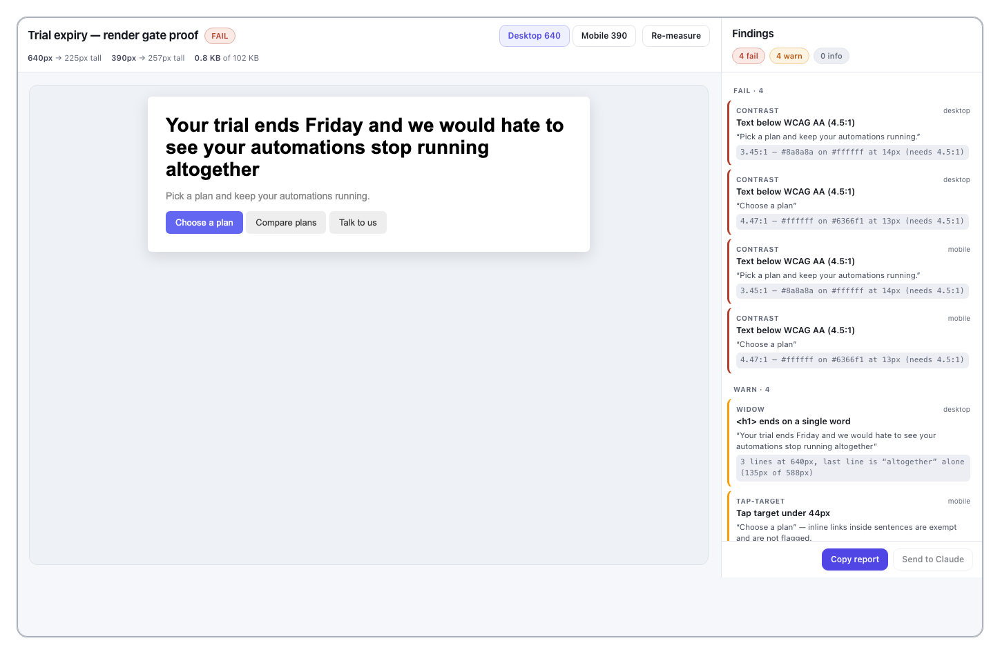
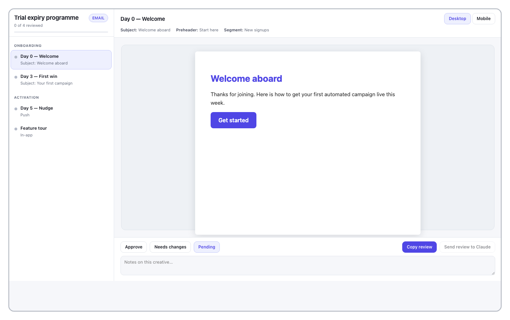

# Orbit

**A lifecycle marketer, built into Claude.** Free, open, no licence key, every tool unlocked.
The GitHub release below is ungated; the website download asks for a free account (one email).

Orbit is an MCP extension that gives Claude a senior lifecycle operator's playbook: 81 skills and 135 tools spanning email and MJML, render QA, segmentation maths, deliverability, brand voice, Figma import, Notion export, diagram generation, and the sending layer itself — Braze, Stripo, Klaviyo, Iterable and the rest. Ask Claude a lifecycle question and it answers like someone who has shipped the program, not like someone who has read about it.

Most "AI for marketing" tools hand you generic email advice. Orbit carries the production-tested mechanics generic reasoning doesn't have — what a real browser reveals that a linter cannot, the Liquid branch nobody test-rendered until it shipped blank, Gmail's clipping limit cutting an email off mid-template, the Braze Canvas QA checklist, the Stripo push trap that silently drops slot values. That's the difference between a draft you can ship and a draft you have to redo. It was built by a lifecycle operator with ten-plus years in CRM seats at Linktree, Depop, Deliveroo, and Trainline — the protocols are the job, written down.

## Try it in ninety seconds

Install the extension, then paste this into Claude. It needs no credentials of any kind:

> Run Orbit's render gate on this email and tell me what a real browser reveals that a linter can't:
> `<html><body style="margin:0"><table width="100%"><tr><td style="padding:24px;font-family:Arial"><h1 style="font-size:28px;margin:0 0 12px">Your trial ends Friday</h1><p style="color:#8a8a8a;font-size:14px">Pick a plan and keep your automations running.</p><a href="#" style="display:inline-block;padding:9px 14px;background:#6366F1;color:#fff;text-decoration:none;border-radius:6px;font-size:13px">Choose a plan</a></td></tr></table></body></html>`

Orbit renders it at 640px and 390px in a real engine and measures what only a render reveals: single-word last lines, CTA rows that wrap, tap targets under 44px, computed contrast, byte size against Gmail's clipping limit. That grey paragraph fails contrast and that button is under the 44px tap minimum — neither is visible in the source.



Those are the real findings from the snippet above. Note the second one: `4.47:1 — #ffffff on #6366f1 at 13px`. That is Orbit's own brand indigo, missing AA by three hundredths. The gate does not make exceptions for the people who wrote it.

Then try `orbit_sample_size`, `orbit_rfm_score`, `orbit_qa_email`, or ask Claude to "load Orbit's winback playbook." Or read the shelf it came with — "list Orbit's guides, then read me the one on dunning" pulls from 91 long-form guides bundled inside the extension, offline, with nothing to log into.

## Build your own lifecycle brain

Orbit's flagship path isn't writing one email. It's giving the programme somewhere to live.

`orbit_bootstrap_brain` scaffolds a git repo — operating rules, conventions, a folder per lifecycle stage — as the single source of truth for your programme. `orbit_learn_email_template` or `orbit_import_design` takes an email you already send (HTML, Figma, PDF) and turns it into a module catalogue plus brand tokens: a design system derived from your real email, not a vendor's template gallery. `orbit_generate_brain_gate` writes the pre-send gate, parameterised to your byte limits and templating branches — the difference between a design system and a folder of files. `orbit_scaffold_brain_program` frames a PRD stub — the one-page spec — for each programme, so AI drafts never build unreviewed.

Most lifecycle work rots for two reasons: the knowledge lives in one person's head, and the templates drift inside the ESP — the platform that actually sends. The repo is the source. The ESP is a derived output.

`orbit_bootstrap_brain` on a fresh path produces exactly this — 14 files, no placeholders:

```
README.md              # the four rules: git canonical, graph derived,
CONVENTIONS.md         # comprehension != enforcement, ESP derived
knowledge/
  decisions-log.md     # every standing ruling, dated
  workflow-learnings.md
  verified-claims.md   # figures with receipts, or they don't ship
programs/
  onboarding/  engagement/  retention/
templates/  build/  assets/  reviews/  reference/
```

## What you get with no credentials at all

Roughly two-thirds of the tool surface needs nothing beyond the install:

- **A render gate and a review gallery.** Interactive MCP App widgets that render creatives at the size they ship at, with per-item approve / needs-changes verdicts. Every review also writes a standalone HTML file you can hand to a stakeholder who has no Orbit — it works on its own.
  
- **Your own email, as each client actually assembles it.** Side by side: the document you authored against the one Gmail builds after its sanitizer has been through it, with the style blocks it dropped and the measured height delta. Each pane says whether it is a real render or the baseline with a condition named but untested — it never shows you a picture of something nobody measured.
- **Calculators that draw.** Cohort retention comes back as the curve and the triangle, with periods a cohort has not lived through drawn as no-data rather than as zero. Plus sample size, significance, RFM, LTV/payback, replenishment, growth forecasting.
- **Your design system, on one sheet.** Paste an email you already send and Orbit reads back the module spine, the palette, a type-and-button specimen drawn with your own tokens, and the WCAG contrast of the four pairs that actually meet on the page.
- **QA and compliance lint** — accessibility (WCAG AA), dark-mode, Gmail clipping, GDPR consent, unsubscribe-page audits against the Gmail/Yahoo bulk-sender rules.
- **The MJML build pipeline** — component-first generation, compile, preview.
- **The skill library** — 80 protocols Claude loads and follows, on lifecycle design, deliverability, Braze mechanics, Stripo mechanics, experimentation, copy, and brand.
- **A 178,000-word practitioner library, offline.** 91 long-form guides ship inside the extension as MCP resources — welcome series, dunning, win-back, deliverability, Liquid, segmentation, experiment design. Claude reads and cites them directly, with no network call and nothing to log into. Ask it to "read Orbit's guide on dunning" and it has the whole thing. A ten-course reading path indexes them by level; the courses themselves are slugs and links, so the lessons open on the site.

## What needs a credential

The remaining tools talk to a third-party platform on your behalf, so they need that platform's own API credentials — yours, not Orbit's. All optional; skip whichever you don't use.

- **Braze** — REST API key + endpoint, to publish templates, read Canvases/campaigns, pull performance data.
- **Stripo** — REST API token (+ plugin credentials for the compose/push flow), to sync modules and export emails.
- **Figma** — API token, to import email designs.
- **Google AI (Gemini)** — API key, for on-brand header image generation.
- **Iterable / Klaviyo / Mailchimp / Customer.io / SFMC** — that platform's API key, for the generic `orbit_esp_*` tools.

Orbit degrades cleanly and tells you what's missing when a tool needs a credential you haven't set.

## Install

**From the MCP registry.** Orbit's registry name is:

```
io.github.justinwilliames/braze-lifecycle-mcp
```

Registry search matches the *name*, not the description, which is why the name says what it does rather than what it is called. Any registry-aware client can install it from that identifier.

> The older `io.github.justinwilliames/orbit-for-claude` entry is **deprecated** and its packages point at pre-0.28 builds that still carry the removed licence gate. If a client offers you that one, use the name above instead.

**Manual.** Download the latest `.mcpb` from [this repo's releases](https://github.com/justinwilliames/orbit-for-claude/releases/latest) — v0.28.0 or newer — and double-click it. You update it yourself.

**From the Claude extension directory.** Open Claude Desktop, go to the extension directory, find Orbit, install. Claude Desktop keeps it updated.

Then, optionally: Claude Desktop → **Settings → Extensions → Orbit** → fill in credentials for whichever platforms you use. They stay local to your machine.

## What Orbit sends home

Orbit posts anonymous usage telemetry to `https://yourorbit.team/api/mcp/telemetry`, on by default. Four event types — `session_start`, `skill_load`, `tool_call`, `tool_error` — each carrying only: the event type, the skill or tool slug, the failure class on errors (one of a fixed set like `timeout` or `auth_failed`), the MCPB version, and an opaque per-install ID. **Prompts, queries, tool arguments, file contents, email HTML and IP addresses are never sent.**

Orbit makes one other call on its own behalf: a startup GET to `https://yourorbit.team/api/orbit/latest-version` to see whether a newer release exists. It sends nothing — no identifiers, no headers about you — and the answer is cached for 24 hours at `~/.orbit/version-cache.json`. It is separate from telemetry on purpose: it is the only way an install already on your machine finds out an update shipped.

Opt out of either independently: untick **Anonymous usage telemetry** in the extension settings or set `ORBIT_TELEMETRY=0`; set `ORBIT_UPDATE_CHECK=0` for the version check. Full detail, including the exact payload shape, is in [PRIVACY.md](PRIVACY.md).

## Licence

MIT — see [LICENSE](LICENSE). Fork it, vendor a skill file into your own stack, rewrite the protocols for your ESP. That's the point.

## Something broken?

Turn on the trace log — Claude Desktop → **Settings → Extensions → Orbit**
→ tick **Debug trace log** (or set `ORBIT_DEBUG_TRACE=1`), restart, and
reproduce. One JSON line per tool call lands in
`~/Orbit/logs/orbit-trace.jsonl`: tool, duration, outcome, response size,
and a *hash* of the arguments — never the arguments themselves, never your
content, never a credential. Safe to paste into an issue as-is.

Then [open a bug report](https://github.com/justinwilliames/orbit-for-claude/issues/new/choose).
The template asks for the version, the host app, `orbit_check_setup`, and
that trace line. Orbit runs locally against accounts nobody else can see,
so those four things are the difference between a fix and a guessing game.
More detail in [docs/SETUP.md](docs/SETUP.md#when-something-is-actually-broken).

Anything else: [yourorbit.team](https://yourorbit.team).
